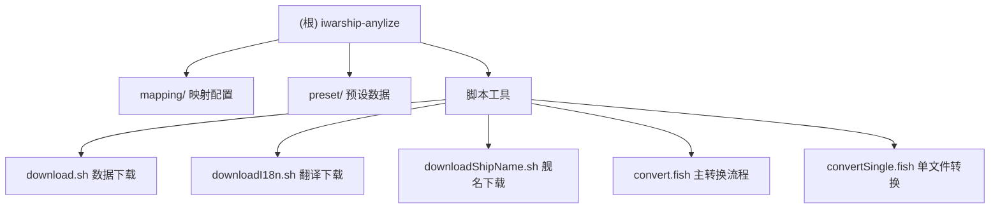

# iwarship-anylize 项目文档

## 项目愿景

本项目用于《战舰世界》(World of Warships) 数据的自动化抓取、转换与分析。通过从 iwarship.net 网站获取原始游戏数据，经过映射转换后输出为标准化的 CSV 格式，便于后续数据分析和可视化。

## 架构总览

本项目采用 **Shell 脚本 + Fish 脚本 + jq/Perl 文本处理** 的轻量级数据管道架构，无需复杂的依赖，仅依赖系统工具（curl、jq、sed、perl）即可运行。

### 模块结构图



## 模块索引

| 模块 | 路径 | 职责 |
|------|------|------|
| **mapping** | `mapping/` | 存放12个JSON映射文件，定义原始数据字段到CSV输出的转换规则 |
| **preset** | `preset/` | 存放预下载的i18n翻译和舰船名称映射，供转换脚本引用 |
| **scripts** | 根目录脚本 | 数据抓取、转换流程的Shell/Fish脚本集合 |

## 运行与开发

### 环境依赖

- **必须**: `curl`, `jq`, `bash`, `fish`, `sed`, `perl`
- **可选**: `git` (版本控制)

### 快速开始

```bash
# 完整转换流程 (需要 curl 访问 iwarship.net)
./convert.fish

# 或分步骤执行：
./downloadI18n.sh   # 下载国际化数据
./downloadShipName.sh  # 下载舰船名称
./download.sh       # 下载原始游戏数据
./convertSingle.fish <数据类别>  # 转换单个类别
```

### 数据类别列表

支持转换的数据类别（对应 mapping/ 下的映射文件）：

| 类别 | 说明 |
|------|------|
| 空袭 | 航空打击数据 |
| 特色 | 特殊舰船/加成数据 |
| 飞机 | 舰载机属性 |
| 鱼雷 | 鱼雷武器数据 |
| 反潜武器 | 反潜装备数据 |
| 弹道穿深 | 穿甲弹穿透计算 |
| 消耗品 | 消耗品/技能数据 |
| 防空 | 防空火力数据 |
| 副炮 | 副炮武器数据 |
| 火炮 | 主炮武器数据 |
| 船体 | 舰船船体属性 |

## 测试策略

本项目无自动化测试套件。验证方式：

1. **手动检查输出 CSV** - 确认字段完整性
2. **比对原始 JSON** - 确保映射正确
3. **运行时观察进度条** - convertSingle.fish 显示处理进度

## 编码规范

- **Fish 脚本**: 使用 `set` 声明变量，`math` 进行计算，`printf` 控制输出
- **Shell 脚本**: 使用标准 `#!/bin/bash`，依赖 `jq` 进行 JSON 处理
- **映射文件**: JSON 格式，key 为输出CSV列名，value 为 jq 路径表达式
- **字符编码**: CSV 使用 UTF-8 BOM (`\xEF\xBB\xBF` 前缀)

## AI 使用指引

### 添加新数据类别

1. 在 `mapping/` 下创建 `<类别名>mapping.json`，定义字段映射
2. 在 `convert.fish` 中添加 `./convertSingle.fish <类别名>`
3. 映射语法参考现有文件，如 `mapping/船体mapping.json`

### 修改映射字段

编辑对应的 `mapping/*.json` 文件，添加/删除/修改 key-value 对即可。

### 调试转换脚本

```fish
# 查看中间JSON结构
jq '.' temp/船体.json | head -100

# 调试映射表达式
jq 'map(.health)' temp/船体.json
```

## 变更记录 (Changelog)

| 时间 | 操作 | 说明 |
|------|------|------|
| 2025-12-30 00:48:37 | 初始化 | 项目文档初始化，生成 CLAUDE.md |
