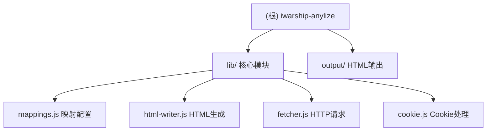

# iwarship-anylize 项目文档

## 项目愿景

本项目用于《战舰世界》(World of Warships) 数据的自动化抓取、转换与分析。通过从 iwarship.net 网站获取原始游戏数据，经过映射转换后输出为标准化的 **HTML** 交互式网页格式，便于后续数据分析和可视化。

## 架构总览

本项目采用 **Node.js + ESM 模块** 的现代化数据管道架构。

### 模块结构图


```mermaid
graph TD
    A["(根) iwarship-anylize"] --> B["lib/ 核心模块"]
    A --> C["output/ HTML输出"]

    B --> B1["mappings.js 映射配置"]
    B --> B2["html-writer.js HTML生成"]
    B --> B3["fetcher.js HTTP请求"]
    B --> B4["cookie.js Cookie处理"]

    click B "./lib/CLAUDE.md" "查看 lib 模块文档"
```

## 模块索引

| 模块 | 路径 | 职责 |
|------|------|------|
| **lib** | `lib/` | Node.js 核心模块集合，包含映射配置和输出功能 |
| **output** | `output/` | HTML 交互式网页输出目录 |

## 运行与开发

### 环境依赖

- **必须**: Node.js (v14+), npm

### 快速开始

```bash
# 1. 安装依赖
npm install

# 2. 配置 Cookie
cp cookie.txt.example cookie.txt
# 编辑 cookie.txt，填入您的 Cookie

# 3. 运行抓取
node fetch-data.js
# 或带参数
node fetch-data.js -c my-cookie.txt -o ./output
```

### 命令行选项

| 选项 | 说明 | 默认值 |
|------|------|--------|
| `-c, --cookie <file>` | Cookie 文件路径 | cookie.txt |
| `-o, --output <dir>` | 输出目录 | output |
| `-h, --help` | 显示帮助 | - |
| `-v, --verbose` | 详细输出 | - |

### 输出格式

- **位置**: `output/` 目录
- **格式**: Bootstrap 5 + Bootstrap Table 交互式表格
- **功能**: 支持筛选、排序、分页

### 数据类别列表

| 类别 | 说明 |
|------|------|
| 空袭 | 航空打击数据 |
| 特色 | 特殊舰船/加成数据 |
| 飞机 | 舰载机属性 |
| 鱼雷 | 鱼雷武器数据 |
| 反潜武器 | 反潜装备数据 |
| 弹道穿深 | 穿甲弹穿透计算 |
| 消耗品 | 消耗品/技能数据 |
| 防空 | 防空火力数据 |
| 副炮 | 副炮武器数据 |
| 火炮 | 主炮武器数据 |
| 船体 | 舰船船体属性 |
| 声呐 | 声呐设备数据 |

## 测试策略

本项目无自动化测试套件。验证方式：

1. **手动检查输出 HTML** - 确认字段完整性
2. **比对原始 JSON** - 确保映射正确
3. **运行时观察日志** - 查看数据抓取进度

## 编码规范

- **JavaScript**: 使用 ESM (`import`/`export`)
- **Node.js**: 依赖原生模块 (fs, https, path, url)
- **映射配置**: 直接在 `lib/mappings.js` 中定义
- **字符编码**: UTF-8

## AI 使用指引

### 添加新数据类别

1. 在 `lib/mappings.js` 中添加该类别的映射配置对象
2. 在 `fetch-data.js` 中添加该类别的抓取逻辑

### 修改映射字段

编辑 `lib/mappings.js` 中对应的映射对象即可。

### 调试数据抓取

```javascript
// 查看抓取的原始数据
console.log(JSON.stringify(rawData, null, 2))

// 调试映射
const mapping = getMapping('船体')
console.log(mapping)
```

## 变更记录 (Changelog)

| 时间 | 操作 | 说明 |
|------|------|------|
| 2025-12-30 00:48:37 | 初始化 | 项目文档初始化，生成 CLAUDE.md |
| 2026-03-03 00:00:00 | 更新 | 添加 lib/ 模块文档，更新 HTML 输出说明 |
| 2026-03-03 | 重构 | 移除 mapping/ 和 preset/ 目录，映射配置移至 lib/mappings.js |
